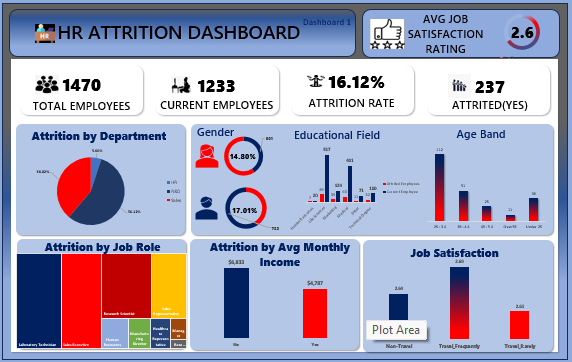
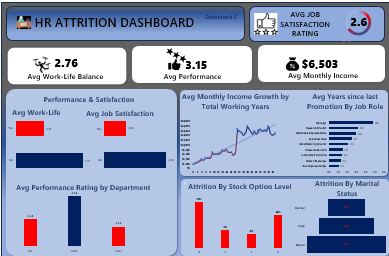
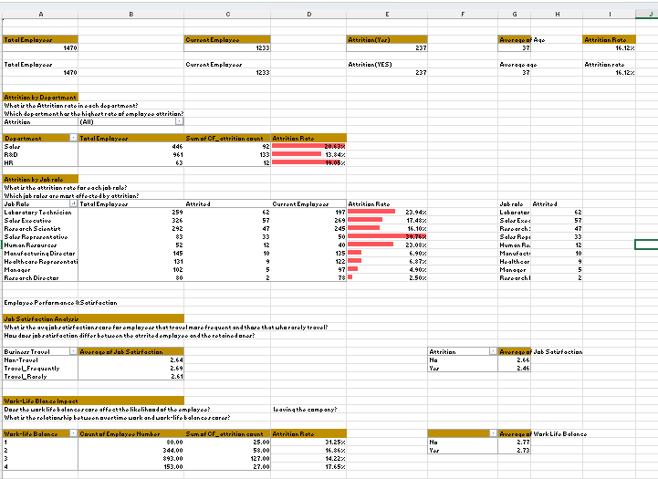
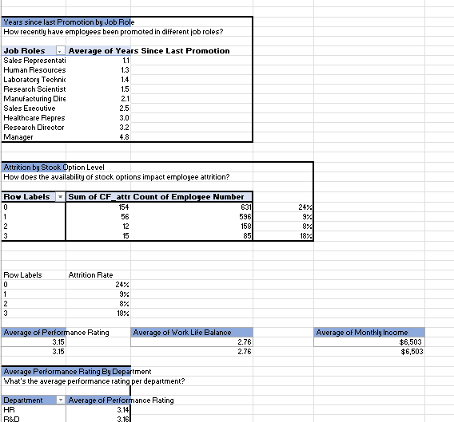
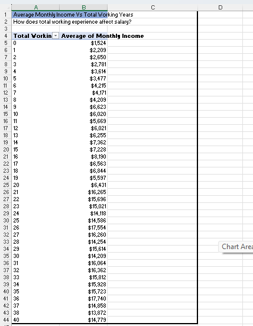
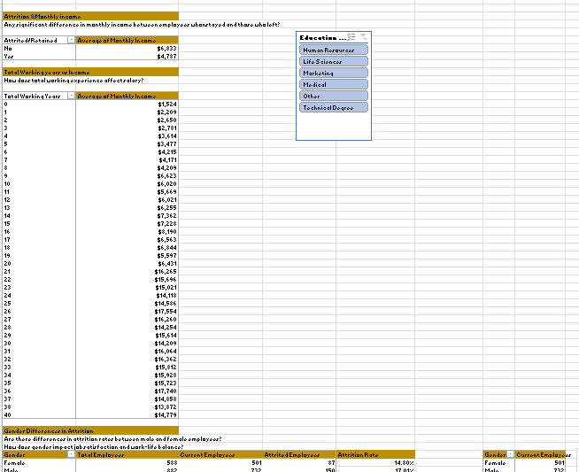

## HR-Analytics-Dashboard-Using-Excel
In this project, i analyzed an HR dataset to uncover insights about employee attrition in an organization. Built entirely with Microsoft Excel. The dashboard includes pivot tables, charts and slicers to visualize the trends across several employee attributes. The goal is to help HR teams understand key factors driving attrition and inform data driving decision making.

---
### Project Overview
This HR analytics project was builts using **Excel**, and it focuses mainly on analyzing HR data, aiming to analyze employee attrition and the key factors behind it. Using pivot tables, charts and calculated fields. I analyzed patterns in attrition based on factors like job roles, department, education, income, and years of experience. The dashboard provides insights to help HR teams understand where attrition is most common and what might be inflencing employees decision to leave.

---
### Problem Statement
Employee attrition is one of the most critical challenges faced by most organizations today, cause it impacts productivity and financial costs. High turnover can lead to increased hiring costs, productivity loss, and decreased employee morale. Understanding the key factors driving attrition and other workforce trends is essential for HR departments to make data informed decisions.

---
### **Dataset Description**
The dataset used is the IBM HR Analytics Employee Attrition dataset, containing 1,470 employee records. Each row represents an employee with the following fields:
- Attrition: This indicate if an employee left the company(Yes/No)
- Age: The age of the employee
- Department: Department the employees work in (Sales, HR, etc.)
- Job Role: Specific job position
- Monthly income: Monthly Salary
- YearsAtCompany:	Total years with the company
- Gender,Education,Marital Status, BusinessTravel, Demographic and Job Related info.
---
  ### Tools Used
- Microsoft Excel
- Pivot Tables
- Pivot Charts(Pie,Bar,Line)
- Conditionl Formatting
- Slicers
---
  ### Dashboard
  

  

---
  ### Methodology
  This project analyzes employee attrition trends using Microsoft Excel, focusing on data transformation, analysis, and visualization:

 - **Data Import & Transformation**  
   The IBM HR dataset was imported into Excel. Data Cleaning was done by removing Unnecessary columns, excess spaces,duplicates etc. Relevant data types were verified, and new calculated fields like attrition rate and average income were created using formulas.

- **Exploratory Data Analysis (EDA)**  
   Pivot Tables were used to analyze the data from different angles—by department, job role, gender, education, and more. This helped in identifying key trends, such as high attrition areas or departments with low satisfaction scores.

- **Data Visualisation**  
   An interactive dashboard was built using Pivot Charts and Slicers. Charts like bar graphs, line charts, and doughnut visuals were employed to make the insights intuitive and visually appealing.These dashboards made it more easier to communicate our findings and results and also to highlight the key factors contributing to employee attrition in the organization. Slicers made the dashboard dynamic, allowing users to filter and explore data in real time.

- **Insight Extraction**  
   The final dashboard provided actionable insights around attrition, employee income, job satisfaction, and promotion delays. These insights can help HR departments make more informed decisions around employee engagement and retention strategies.

---
### Pivot Tables

---

 

