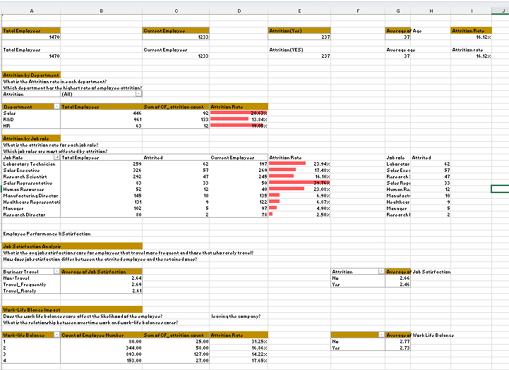
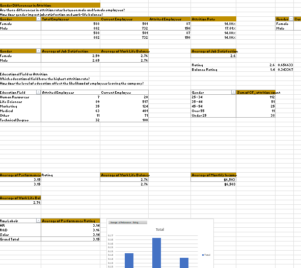
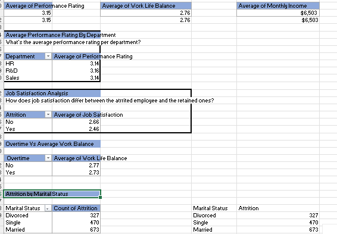

## HR-Analytics-Dashboard-Using-Excel
In this project, i analyzed an HR dataset to uncover insights about employee attrition in an organization. Built entirely with Microsoft Excel. The dashboard includes pivot tables, charts and slicers to visualize the trends across several employee attributes. The goal is to help HR teams understand key factors driving attrition and inform data driving decision making.

---
### Project Overview
This HR analytics project was builts using **Excel**, and it focuses mainly on analyzing HR data, aiming to analyze employee attrition and the key factors behind it. Using pivot tables, charts and calculated fields. I analyzed patterns in attrition based on factors like job roles, department, education, income, and years of experience. The dashboard provides insights to help HR teams understand where attrition is most common and what might be inflencing employees decision to leave.

---
### Problem Statement
Employee attrition is one of the most critical challenges faced by most organizations today, cause it impacts productivity and financial costs. High turnover can lead to increased hiring costs, productivity loss, and decreased employee morale. Understanding the key factors driving attrition and other workforce trends is essential for HR departments to make data informed decisions.

---
### **Dataset Description**
The dataset used is the IBM HR Analytics Employee Attrition dataset, containing 1,470 employee records. Each row represents an employee with the following fields:
- Attrition: This indicate if an employee left the company(Yes/No)
- Age: The age of the employee
- Department: Department the employees work in (Sales, HR, etc.)
- Job Role: Specific job position
- Monthly income: Monthly Salary
- YearsAtCompany:	Total years with the company
- Gender,Education,Marital Status, BusinessTravel, Demographic and Job Related info.
---
  ### Tools Used
- Microsoft Excel
- Pivot Tables
- Pivot Charts(Pie,Bar,Line)
- Conditionl Formatting
- Slicers
---
  ### Dashboard
  

  

---
  ### Methodology
  This project analyzes employee attrition trends using Microsoft Excel, focusing on data transformation, analysis, and visualization:

 - **Data Import & Transformation**  
   The IBM HR dataset was imported into Excel. Data Cleaning was done by removing Unnecessary columns, excess spaces,duplicates etc. Relevant data types were verified, and new calculated fields like attrition rate and average income were created using formulas.

- **Exploratory Data Analysis (EDA)**  
   Pivot Tables were used to analyze the data from different angles—by department, job role, gender, education, and more. This helped in identifying key trends, such as high attrition areas or departments with low satisfaction scores.

- **Data Visualisation**  
   An interactive dashboard was built using Pivot Charts and Slicers. Charts like bar graphs, line charts, and doughnut visuals were employed to make the insights intuitive and visually appealing.These dashboards made it more easier to communicate our findings and results and also to highlight the key factors contributing to employee attrition in the organization. Slicers made the dashboard dynamic, allowing users to filter and explore data in real time.

- **Insight Extraction**  
   The final dashboard provided actionable insights around attrition, employee income, job satisfaction, and promotion delays. These insights can help HR departments make more informed decisions around employee engagement and retention strategies.

---
### Pivot Tables

---
### Formula used for calculating Attrition Rate
= [Number of Attrition] / [Total Employees]
---
### Insights and Findings:
---
Here are the few insights that were discivered from the dataset.
- The sales department experiences the highest attrition rates, with a notable increase in turnover due to the high-pressure demands of the job. This frequent turnover is often attributed to the challenging and fast-paced environment, which can eventually lead to job dissatisfaction.
  
- Employees with lower salaries ranges are more likely to leave the organization, especially when they don't experience growth opportunities also combined with low job satisfaction. Although salary increases with years of experience, attrition remains present among employees with higher tenure. This suggests that while compensation is competitive, other factors such as career growth, job satisfaction, and work environment may be influencing employee retention
  
- Low work-life balance and job satisfaction are significant factors that leads to employee attrition.
  
- Employees in the 18-24 age group, typically with 0 to 5 years of work experience, exhibit the highest attrition rates. This is likely due to career exploration and the pursuit of better opportunities, as they seek to establish more fulfilling career paths.
  
- Frequent business travel is a significant factor contributing to high turnover rates, as the demands of constant travel can lead to burnout, work-life imbalance, and dissatisfaction with the job.
  
- Roles with higher average years since last promotion might indicate fewer advancement opportunities, which could correlate with higher attrition or lower job satisfaction.

- Employees with no stock options appear more likely to leave, suggesting that offering stock options might contribute to retention
---
### Recommendations
- **Ensure equitable career development opportunities across all roles and genders**:
This recommendation emphasizes providing equal opportunities for career advancement to all employees, regardless of their role or gender. The data indicates that employees in their early career stage (18-24years) with 0 to 5 years experience are more likely to leave.Ensuring equity in career development opportunities—such as training, promotions, and leadership roles—helps to create a fair and inclusive workplace. This can boost employee morale and retention, especially among underrepresented groups, as they feel valued and have clear pathways for advancement.

- **Create onboarding and mentorship programs for new employees to improve early-stage retention**:
Onboarding and mentorship programs are designed to help new employees feel welcomed and supported from the start. A structured onboarding process helps employees understand their roles, the company's culture, and their potential for growth, which leads to better retention. Pairing new hires with mentors gives them a go-to person for guidance, further promoting a sense of belonging and reducing the likelihood of early-stage attrition.

- **Encourage Work-Life Balance**:
  As work-life imbalance contributes significantly to attrition, the organization should explore flexible work arrangements, like remote work or flexible hours. Furthermore, minimizing business travel or offering compensatory benefits for employees who travel frequently could help reduce turnover and enhance overall employee well-being.

- **Evaluate and Enhance Compensation Packages**: To further reduce attrition, the organization should evaluate and enhance its compensation packages to ensure they are competitive and aligned with industry standards. Offering appealing salaries, performance-based bonuses, and comprehensive benefits can boost employee retention and satisfaction.

- **Implement regular job satisfaction surveys to identify and address employee concerns proactively**:
Job satisfaction surveys allow the organization to regularly gauge how employees feel about their work environment, compensation, career development opportunities, and other key factors. By proactively addressing concerns identified in these surveys, such as workload, communication, or management issues, the organization can improve employee satisfaction and reduce turnover.
---

### Conclusion  
Implementing the recommendations outlined in this project will help the organization foster a more supportive and engaging work environment. By focusing on retention strategies, offering flexible work options, addressing compensation, and promoting career development, the organization can significantly reduce attrition and enhance employee satisfaction. These measures will not only improve workforce stability but also contribute to a more motivated and productive team.
 

