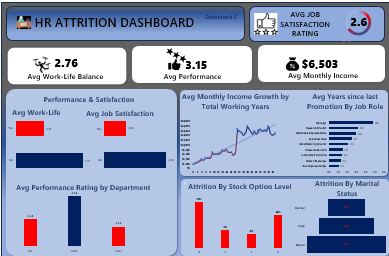

## HR-Analytics-Dashboard-Using-Excel
In this project, I analyzed an HR dataset to uncover insights about employee attrition. Built entirely with Microsoft Excel, the dashboard includes pivot tables, charts, and slicers to visualize trends across several employee attributes. The goal is to help HR teams understand key factors driving attrition and inform data-driven decision-making.
---
### Project Overview
This HR analytics project was built entirely using Excel, and it focuses mainly on analyzing HR data,aiming to explore employee attrition and the key factors behind it. Using pivot tables, charts, slicers, and calculated fields, I analyzed patterns in attrition based on factors like job roles, departments, education, income, and years of experience. The dashboard provides insights to help HR teams understand where attrition is most common and what might be influencing employee decisions to leave.

### Problem Statement
Employee attrition is one of the most critical challenges faced by mostorganizations today. High turnover can lead to increased hiring costs, productivity loss, and decreased employee morale. Understanding the key factors driving attrition and other workforce trends is essential for HR departments to make data-informed decisions.

### Dataset Description
The dataset used is the IBM HR Analytics Employee Attrition dataset, containing 1,470 employee records. Each row represents an employee with the following fields:
- Attrition: This indicate if an employee left the company(Yes/No)
- Age: The age of the employee
- Department: Department the employees work in (Sales, HR, etc.)
- Job Role: Specific job position
- Monthly income: Monthly Salary
- YearsAtCompany:	Total years with the company
- Gender,Education,Marital Status, BusinessTravel, Demographic and Job Related info.

  ### Tools Used
- Microsoft Excel
- Pivot Tables
- Pivot Charts(Pie,Bar,Line)
- ConditionL Formatting
- Slicers

  ### Dashboard
  
  
 

